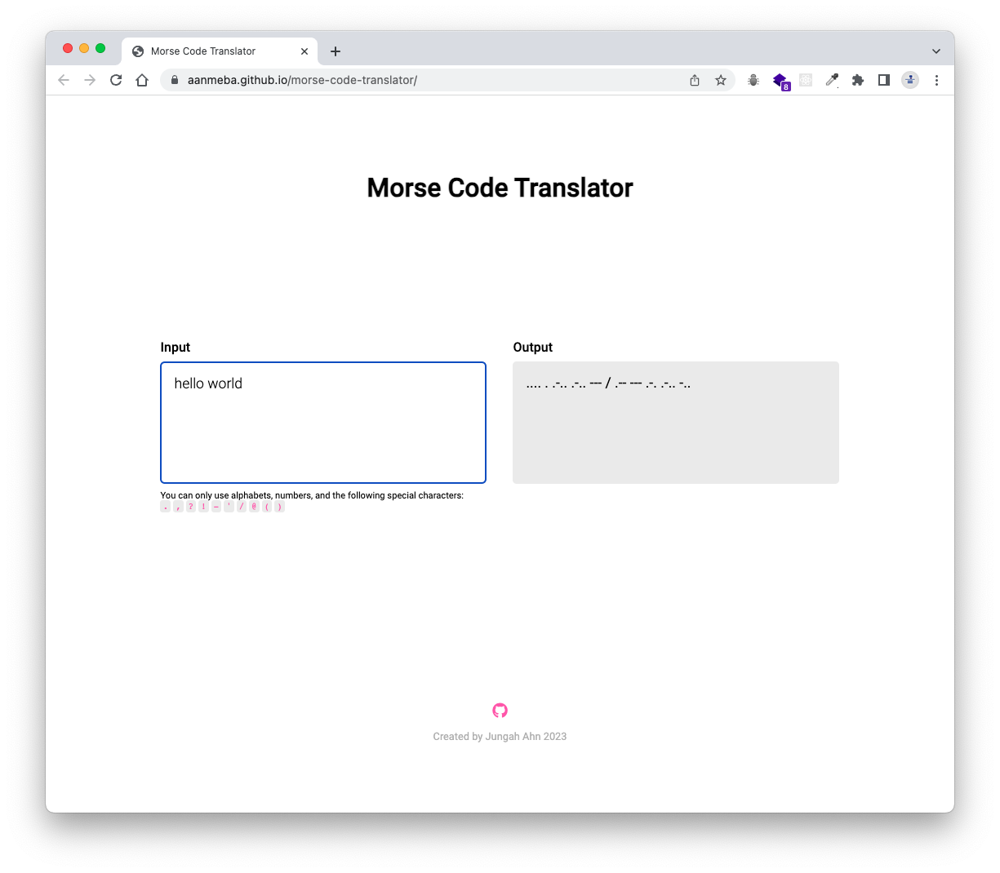
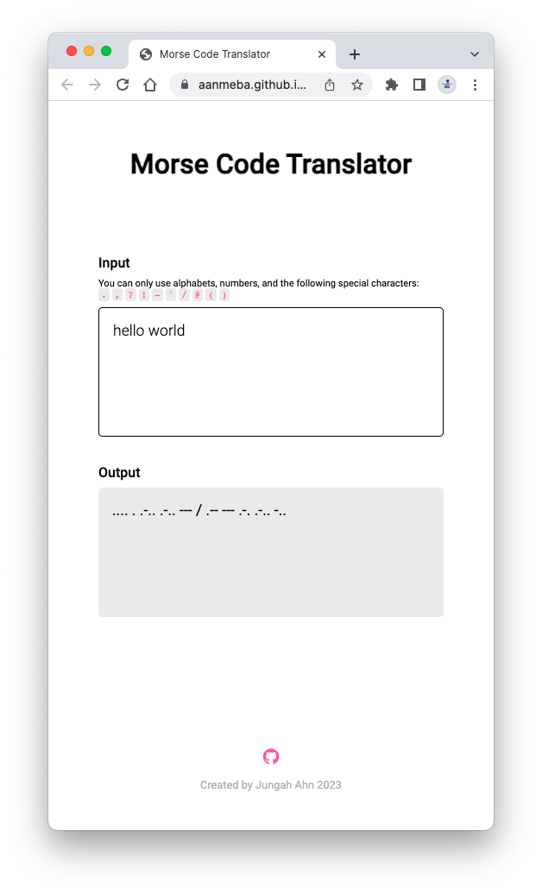

# Morse Code Translator

A simple web page that allows users to translate text to Morse code and vice versa. Once you enter either English text or Morse code in the input field, the translated result will be displayed in the output area.

👉 [Morse Code Translator](https://aanmeba.github.io/morse-code-translator/)

## Features

- Translation between English text and Morse code in both directions.
- **Properly handle spaces**: In the Morse code output, a `/` is used instead of a space between words in text, and there is a space between characters.
- **Validate input**: The application checks the validity of the input and remove any invalid characters.
- **Responsive design**: The web page is designed with a responsive layout, making it accessible and user-friendly across different devices and screen sizes.

## Screenshots

Desktop

Mobile

